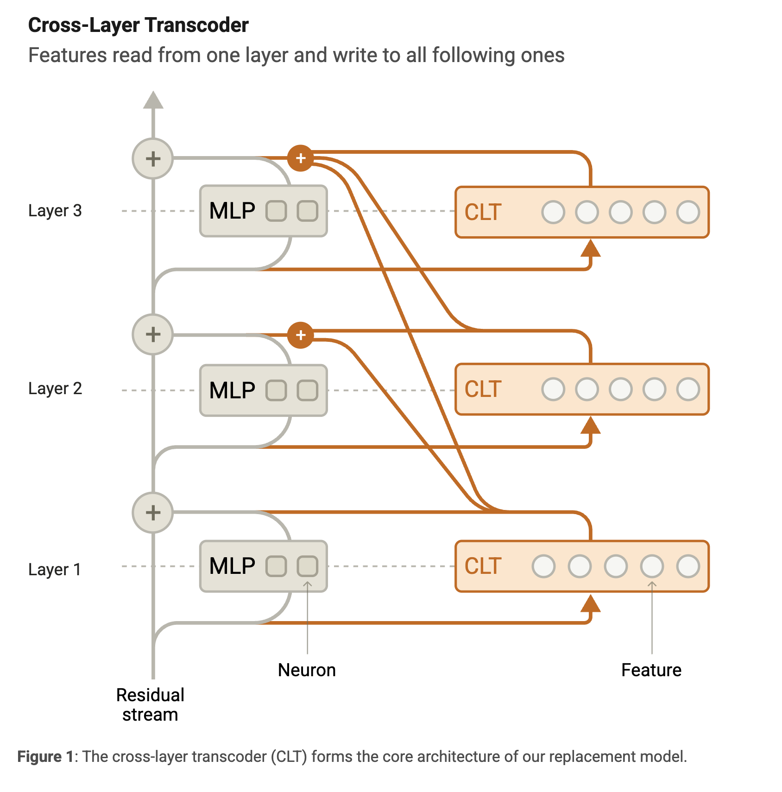
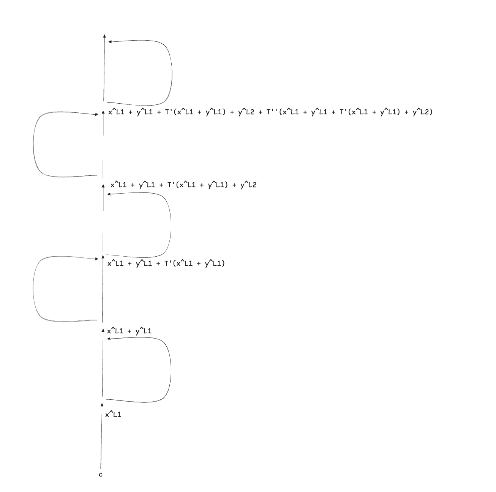
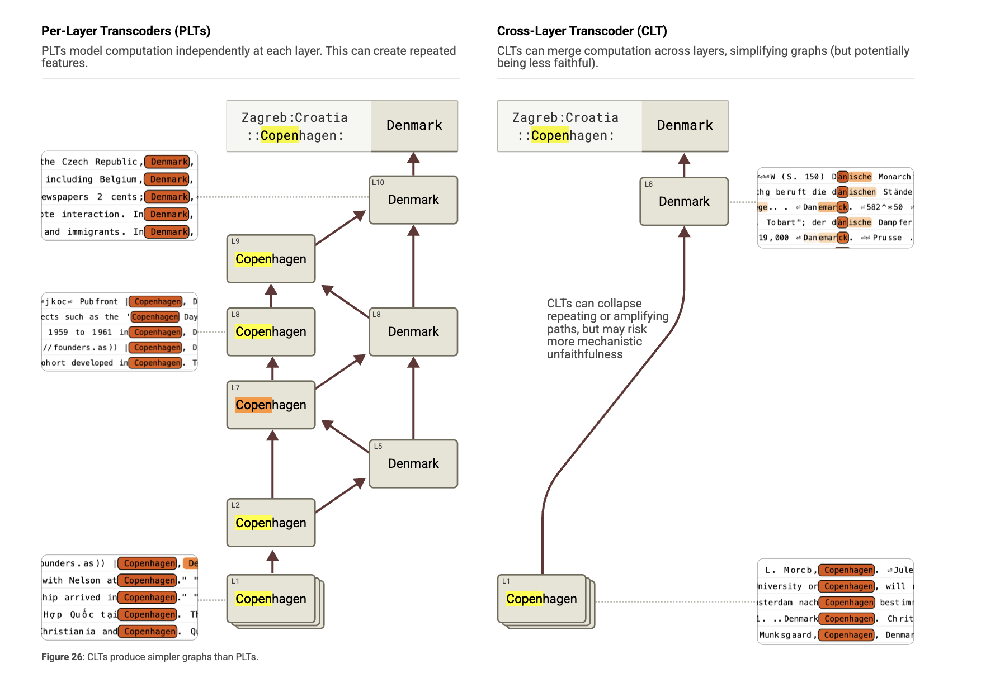

# Notes on attribution graphs via PLT and CLT

As part of my frenzied, unstructured research path over the last month, I started with [sparse auto-encoders](https://transformer-circuits.pub/2023/monosemantic-features) (SAEs) (2023), then jumped straight into the super-recent [natural language autoencoders](https://transformer-circuits.pub/2026/nla/index.html#nla-training) (NLAs) (2026). Now I'm reading about cross-layer transcoders (CLTs) (2025) for the first time through the [*Circuit Tracing: Revealing Computational Graphs in Language Models* paper](https://transformer-circuits.pub/2025/attribution-graphs/methods.html) from Anthropic. 

As I lacked some technical background to fully understand the paper, a few questions emerged during my first read. This article contains the answers to that questions and can be viewed as a complementary for that paper.

## Why we couldn't we simply build circuits starting from SAE features?

As I was only familiar with SAE features extracted from an activation layer, it felt to me that this was already a good enough approximation to extract "thoughts" and "concepts" from an LLM. Circuits could be drawn by measuring the activating features at each activation layer and drawing a map. But crucially, this map would not allow us to draw a connection between a feature activated at layer $\ell$ and a feature activating at layer $\ell - 1$. This is because there's a lot of non-linearity involved between these two layers, and drawing a clean linear relation between two given features wouldn't be possible. And this is the problem that the authors of the paper are solving via cross-layer transcoders (CLT). They allow to analyze feature to feature interactions across layers and token positions for a given prompt. This is possible by building a replacement model that approximates the original model. The relations between any two features, at different layers and different token positions, are purely linear.

## What are PLTs?

As I was reading through the paper, I discovered the concept of a per-layer transcoder, which is the predecessor of CLTs. The paper glosses over the history of PLTs, but I guess it is necessary to understand what they are in order to eventually understand why CLTs are even needed.

First and foremost, PLTs are a structure used to replace an MLP layer of a model. A per‑layer transcoder, compared to the same layer's SAE, is approximating a function rather than reconstructing a state.

The vector $\mathbf{x} \in \mathbb{R}^{D}$ is the residual stream entering the MLP layer, while $\mathbf{y}$ is the output of the model MLP at the same layer. 

The PLT is designed by training the encoder weights $\mathbf{W}_{enc} \in \mathbb{R}^{F \times D}$ and the decoder weights $\mathbf{W}^{dec} \in \mathbb{R}^{D \times F}$ such that the attemped reconstruction $\hat{\mathbf{y}}^\ell = \mathbf{W}_{dec} \mathbf{a}$ should approximate well $\mathbf{y}$ 

$\mathbf{a}$ is the feature activation vector, which is calculated as follows:

$$\mathbf{a} = \mathrm{JumpReLU}(\mathbf{W}_{enc} \mathbf{x})$$

The PLT is trained with two goals:
- to closely approximate the target vector 
- to do that using sparsely active features.

In PLT, a feature writes its contribution, via the decoder, only back to layer $\ell$

In CLT, a feature writes its contribution, via the decoder, to layer $\ell$ and all the subsequent layers ($\ell+1, \dots, L$). 

This difference is the **crosslayer** component of CLTs.

In CLT the attempted reconstruction $\hat{\mathbf{y}}$ at layer $\ell$ is calculated as follows

$$\hat{\mathbf{y}}^\ell = \sum_{\ell'=1}^\ell \mathbf{W}_{dec}^{\ell' \to \ell} \mathbf{a}^{\ell'}$$

Where $\mathbf{W}_{dec}^{\ell' \to \ell} \in \mathbb{R}^{D \times F}$ are the learned decoder weights corresponding to the for features at layer $\ell'$ to layer $\ell$. 

This difference has a downstream effect on the training process as well. All the layers of the CLT must be trained jointly since the (first) training goal is to minimize the reconstruction error loss summed across MLP output layers activations. The second training goal is analogous to PLTs and SAEs.

Notice that if we were to train a PLT, that would be:
- cheaper in terms of parameters. For a CLT for a model of $L$ layers, there's gonna be $\frac{L(L+1)}{2}$ decoder weight matrices, while a PLT for the same model results in $L$ decoder matrices
- more parallel to train, since the training goals for each layer are independent of each other 

## How is the feature-to-feature linear attribution weight in the attribution graph computed?

This was the toughest thing to understand as I initially approached the paper. 

In the introduction, they claim that an alternative approach leveraging PLTs instead of CLTs would still work fine and allow for obtaining an attribution graph. Based on what we saw in the previous answer, PLTs and CLTs are quite similar, and the former is a slightly simplified version of the latter. Because of that, I will explain how to compute the feature-to-feature linear attribution weight in the case of PLT. 

Before discussing the attribution graph and its edges' weights, it is necessary to mention the concept of the **local replacement model**, which is the tool used to ultimately extract the attribution graph for a given prompt.

Let's assume that we have successfully trained PLTs for each MLP layer of an original model. A local replacement model is generated, for a specific prompt $p$, starting from the original model and the trained PLTs by:

- Substituting the MLP layers of the original model with the trained PLTs
- Using the attention patterns and normalization denominators extracted by running the original model's forward pass on $p$ prompt
- Adding an error adjustment to the PLT output at each (token position, layer) pair equal to the difference between the true MLP output on $p$ and the PLT output on $p$

The result is that the local replacement model output token matches the output token of the original model 100% of the time. The approximation error is filled with the error adjustment.

From the paper (I replaced CLT with PLT):

> The local replacement model can be viewed as a very large fully connected neural network, spanning across tokens, on which we can do classic circuit analysis:
> - Its input is the concatenated set of one-hot vectors for each token in the prompt.
> - Its neurons are the union of the PLT features active at every token position.
> - Its weights are the summed interactions over all the linear paths from one feature to another, including via the residual stream and through attention, but not passing through MLP or PLT layers. Because attention patterns and normalization denominators are frozen, the impact of a source feature's activation on a target feature's pre-activation via each path is linear in the activation of the source feature.
> - Additionally, it has bias-like nodes corresponding to error terms, with a connection from each bias to each downstream neuron in the model.
> 
> The only nonlinearities in the local replacement model are those applied to feature preactivations.

The final result is that in the replacement model, the map from any source feature's activation to any target feature's pre-activation is a composition **of linear operations only**. Note that the source feature and the target feature can belong to different layers and different token positions. That linearity is precisely what lets you flatten the layered transformer into one big fully-connected network and "do classic circuit analysis."

The formula to calculate the attribution weight going from source feature $s$ at layer $\ell_s$ and context position $c_s$ to target feature $t$ at layer $\ell_t$ and context position $c_t$ is defined as follows for the case of PLT:

$$A_{s \to t} = a_s w_{s \to t} = a_s  \mathbf{W}_{\{\text{dec}, s\}}^{\ell_s} J^\blacktriangledown_{c_s, \ell_s \to c_t, \ell_t} \mathbf{W}_{\{\text{enc}, t\}}^{\ell_t}$$

From the paper:

> $J^\blacktriangledown_{c_s, \ell_s \to c_t, \ell_t}$ is the Jacobian of the underlying model with a stop-gradient operation applied to all model components with nonlinearities -- the MLP outputs, the attention patterns, and normalization denominators -- on a backwards pass on the prompt of interest, from the residual stream at context position $c_t$ and layer $\ell_t$ to the residual stream at context position $c_s$ and layer $\ell_s$. 

More explanation about the Jacobian expansion from the paper's appendix:

> The Jacobian $J^\blacktriangledown_{c_s, \ell_s \to c_t, \ell_t}$ can be expanded into a sum over all paths of length $\ell_t - \ell_s$ in the underlying model through attention heads and residual connections. Consider a path $p$ starting at position $c_s$ and layer $\ell_s$ and ending at position $c_t$ and layer $\ell_t$ consisting of $i = 1, 2, \dots, (\ell_t - \ell_s)$ steps, each of which is either a residual stream step going from layer $\ell + i - 1$ to $\ell + i$ or an attention head step going from position $c_i$ to $c_{i+1}$ via attention head $h_i$ with attention weight $a_{c_i \to c_{i+1}}^{h_i}$ and applying transformation $OV_{h_i}$. Each step is associated to a linear transformation $\pi_i$ which is the identity for a residual stream step and $a_{c_i \to c_{i+1}}^{h_i} OV_{h_i}$ for an attention step. The whole path $p$ is thus associated to a linear transformation $\pi_p = \prod_i \pi_i$. Then we can write
> $$J^\blacktriangledown_{c_s, \ell_s \to c_t, \ell_t} = \sum_{p \in \mathcal{P}(c_s, c_t, \ell_s, \ell_t)} \pi_p$$
> where $\mathcal{P}(c_s, c_t, \ell_s, \ell_t)$ is the set of all paths starting at position $c_s$ and layer $\ell_s$ and ending at position $c_t$ and layer $\ell_t$.

This might look (at least for me!) intimidating and hard to grasp at first. We'll get there step by step using various toy examples. 

### Toy example 1: cross-layer, same token position, MLP-only

In the first toy example, we consider a replacement model with three MLP layers (replaced with PLT) and, more importantly, no attention layers. In this model, for a given prompt $p$, we want to study the attribution weight going from feature $s$ at position $c$ and layer $\ell_1$ to feature $t$ at position $c$ and layer $\ell_3$. Recall that the linear relation is measured at the preactivation of the target feature at $\ell_3$.

We can draw it as follows: 

We notice that there's no attention head in our model. In the context of the Jacobian definition, this means that the only path possible from $s$ to $t$ is through a sequence of residual stream steps, which reduces the Jacobian matrix down to an identity matrix. We can see, therefore, how the Jacobian term disappears from the formula to derive $A_{s \to t}$

$$A_{s \to t} = a_s w_{s \to t} = a_s  \mathbf{W}_{\{\text{dec}, s\}}^{\ell_1} \mathbf{W}_{\{\text{enc}, t\}}^{\ell_3}$$

But how do we get to that formula?

The preactivation (before the non-linear JUMPReLU) of feature $t$ at layer $\ell_3$ is equal to:

$$h_t^{\ell_3} = \mathbf{W}_{\{\text{enc}, t\}}^{\ell_3} \mathbf{x}^{\ell_3}$$

Thanks to the **linearity** of the model (strictly, the pre-activation of a feature is linear with respect to the activations of earlier features), we can further decompose $\mathbf{x}^{\ell_3}$, to analyze the contribution to that activation from each feature from each of the previous layers. 

$$\mathbf{x}^{\ell_3} = \mathbf{x}^{\ell_1} + \mathbf{y}^{\ell_1} + \mathbf{y}^{\ell_2}$$

The contribution from feature $s$ measured at layer $\ell_1$ can be extracted from $\mathbf{y}^{\ell_1}$ as follows:

$$\mathbf{y}_s^{\ell_1} = \mathbf{W}_{\{\text{dec}, s\}}^{\ell_1} a{_s}$$

So, we can eventually define the contribution of feature $s$ to feature $t$ as described in the original formula.

There's another important thing to notice before moving up to the next toy example.

Feature $s$ at Layer 1 does influence feature $t$ at Layer 3, not only through this pathway.

If we look at the residual stream arriving at Layer 3 $\mathbf{x}^{\ell_3}$ again, there's a direct influence path, through the main highway, and an indirect influence path, through the PLT layer. 

The direct path: $\mathbf{y}^{\ell_1}$ bypasses the PLT (and its non-linearity) at Layer 2 and flows straight down to the pre-activation of feature $t$ at layer 3 through the main residual highway.

The indirect path: $\mathbf{y}^{\ell_1}$ flows into the PLT (and its non-linearity) at Layer 2, contributing to the computation of $\mathbf{y}^{\ell_2}$, which flows to the pre-activation of feature $t$ at layer 3. In this path, what happens is that feature $s$ will trigger some new feature (let's call it feature $m$) inside Layer 2. Feature $m$ then writes its own output to $\mathbf{y}^{\ell_2}$. Finally, feature $t$ reads $\mathbf{y}^{\ell_2}$. 

If the formula for $A_{s \to t}$ tried to calculate the total causal influence of $s$ on $t$, combining the direct path and the indirect path, the latter path would capture the non-linearity of the JUMPReLU included in the activation function of the PLT and therefore break the linear relation that we are trying to map out between the two features. Therefore, this indirect relation is not included in the edge $A_{s \to t}$. Instead, this is captured as a multi-step path: an edge from $s \to m$, and a separate edge from $m \to t$.

The indirect path is the one referred to in the introduction of the paper as follows:

> Features also have indirect interactions, mediated by other features, which correspond to multi-step paths.

### Toy example 2: cross-layer, same token position, MLP + attention

Now let's move to the second toy example. We still want to measure the edge weight between feature $s$ at position $c$ and layer $\ell_1$ and feature $t$ at position $c$ and layer $\ell_3$. The difference here is that after each MLP layer, there's an attention layer. 

The attention head transformation is denoted by $T'$ for the first layer and $T''$ for the second layer.

The contribution $\mathbf{y}_s^{\ell_1}$ might get carried to feature $t$ at layer $\ell_3$ in four possible ways:
- taking two successive residual steps: $\mathbf{y}^{\ell_1}$
- taking a residual step at the first layer and a self-attention step at the second layer:$T''(\mathbf{y}^{\ell_1})$
- taking two successive self-attention steps: $T''(T'(\mathbf{y}^{\ell_1}))$
- taking a self-attention step at the first layer and a residual step at the second layer $T'(\mathbf{y}^{\ell_1})$

Given that all the non-linearities of the attention head are frozen, the transformation $T$ is completely linear and, therefore, additive. $w_{s \to t}$ needs to sum all the possible contributions getting to the target node from the source node. Given that all the transformations over the four paths are linear, we can always derive a matrix $\pi_p$ for each path $p \in \{p_1, p_2, p_3, p_4\}$ such that the contribution from feature $t$ landing at layer $\ell_3$ is equal to $\mathbf{y}^{\ell_1}_s \pi_p$.

We define the total contribution to feature $s$ at layer $\ell_3$ from feature $t$ at layer $\ell_1$ as follows:

$$
\begin{aligned}
A_{s \to t} &= \sum_{p \in \{p_1, p_2, p_3, p_4\}} \mathbf{y}^{\ell_1}_s \pi_p \mathbf{W}_{\{\text{enc}, t\}}^{\ell_3} \\
&= \sum_{p \in \{p_1, p_2, p_3, p_4\}} \mathbf{W}_{\{\text{dec}, s\}}^{\ell_1} a{_s} \pi_p \mathbf{W}_{\{\text{enc}, t\}}^{\ell_3} \\
&= a{_s} \mathbf{W}_{\{\text{dec}, s\}}^{\ell_1} \sum_{p \in \{p_1, p_2, p_3, p_4\}}  \pi_p \mathbf{W}_{\{\text{enc}, t\}}^{\ell_3} \\
&= a{_s} \mathbf{W}_{\{\text{dec}, s\}}^{\ell_1} J^\blacktriangledown_{c, \ell_1 \to c, \ell_3} \mathbf{W}_{\{\text{enc}, t\}}^{\ell_3} \\
\end{aligned}
$$

By doing so, we somehow derived the formula of the Jacobian matrix!

### Toy example 3: cross-layer, cross-token positon, MLP + attention

In last toy example, we want to measure the impact of feature $s$ at token position $c_1$ captured at layer $\ell_1$ to feature $t$ at token position $c_3$ captured at layer $\ell_3$. Looking at the forumla to compute $A_{s \to t}$, the only place in which the token position appears is as subindex of the Jacobian matrix $J^\blacktriangledown$. The encoder and decoder matrices are not dependent on the token position, while the path and the set of linear transformation from source node $s$ to target node $t$ is. 

In this scenario the contribution $\mathbf{y}_s^{\ell_1}$ might get carried to feature $t$ at layer $\ell_3$ in five possible ways:
- attention head at pos 3 reads from pos 1 then residual step
- attention head at pos 3 reads from pos 1 then self attends
- residual step then attention head at pos 3 reads from pos 1
- self attention then attention head at pos 3 reads from pos 1
- attention head at pos 2 reads from pos 1 then attention head at pos 3 reads from pos 2

The application of the same step-by-step transformation, for each tox examples, in a scenario in which the replacement model is built from CLT, instead of PLT, is left as an exercise to the reader. 

## Why CLTs and not PLTs?

After we analyzed both CLT and PLT-based architecture, a natural follow-up question is why they came up with CLT as an improvement version of the original PLT-based approach to compute attribution graphs?

Let's first highlight a core limitation of PLT-based architecture: feature duplication.

MLPs often read a concept from the residual stream and write the exact same concept back into the residual stream to carry it forward to later layers, effectively amplifying the concept. 

Given that the training of PLT happens independently at each individual MLP layer and that the training goal is to reconstruct the output of the MLP only at that specific layer, the consequence is that a similar feature gets mapped across many successive MLP layers. 

When it comes to drawing attribution edges across features, this can be problematic. As observed by the paper authors, PLT might cause highly redundant causal chains. For example, a feature for "Copenhagen" at Layer 1 will activate a "Copenhagen" feature at Layer 2, which activates "Copenhagen" at Layer 3, continuing in a path of length 7 or more.

CLT fixes that. Given that the attempted reconstruction of the MLP output at layer $\ell$ is jointly computed by features from layer $\ell$ and all previous layers ($\ell'$), feature extracted at earlier layers can directly contribute to the reconstruction of MLP outputs in all subsequent layers, somehow merging all at once the feature effect that, in the PLT case, was decomposed across various subsequent layers.
