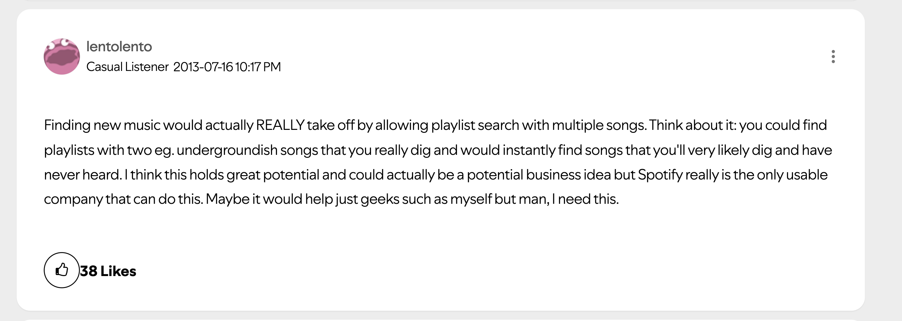
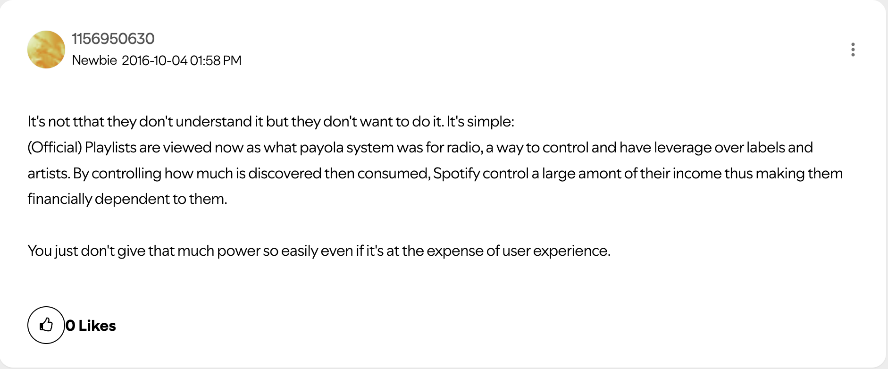
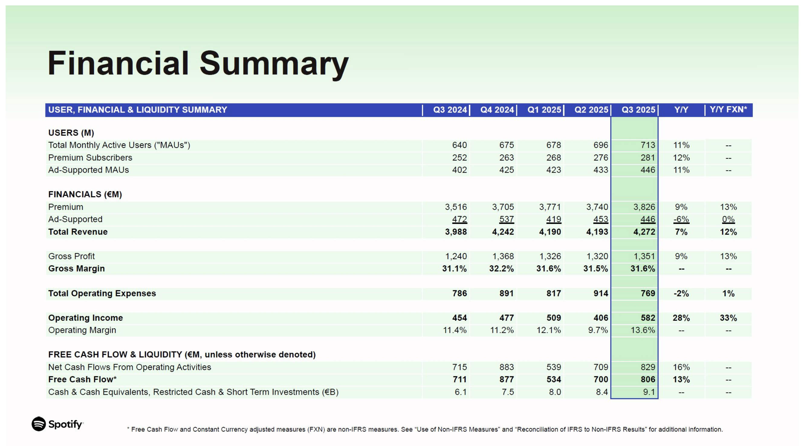
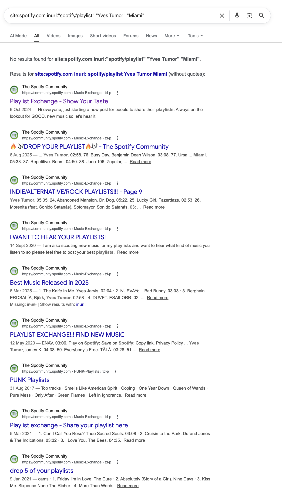
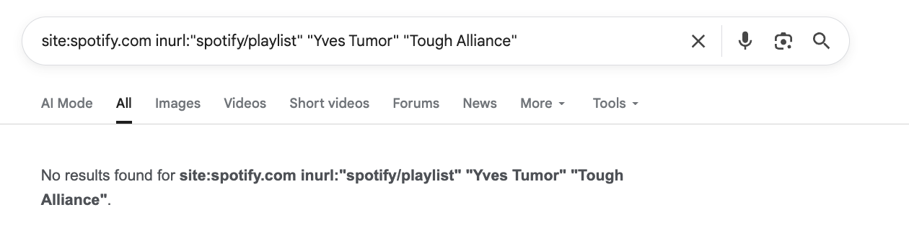
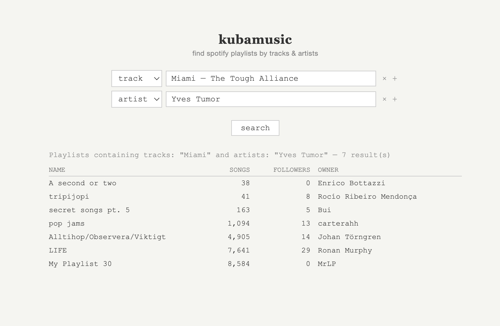

# Why Spotify won't let you query playlists by tracks & artists

> Thanks to Yiğit Kılıçoğlu for discussions and reviews.

I hate apps [add link]. Well, most of the apps. Spotify is one of the few that provides some real value to my life. Spotify is great. Nevertheless, it is not very helpful when I am looking for new music. The homepage recommendations are dumb as fuck. Last week The Strokes released a new track, and Spotify didn't even bother recommending it to me, despite having listened to the band on repeat for over 10 years. On the other side, the radio function seems to always point to a few chosen artists. Have you ever wondered how we all ended up having songs of Still Woozy, Bakar, and Steve Lacy in our library?

ryeguy_24's not-rocket-science [theory](https://community.spotify.com/t5/Live-Ideas/Discover-Find-public-Playlists-that-contain-Song-Artist/idi-p/144576) from 2013 is that *"if someone else's playlist includes a song or artists that I like, there is a good chance that I will enjoy the rest of their playlist"*. At the time of writing, 4081 users subscribe to this theory and believe that Spotify should add this as a permanent feature. For instance, I'd like to find all playlists that contain Yves Tumor AND Miami from The Tough Alliance. Since this is a rather unusual mix, I would expect to love any playlist that includes this.

As you scroll through the [64 pages of discussion](https://community.spotify.com/t5/Live-Ideas/Discover-Find-public-Playlists-that-contain-Song-Artist/idi-p/144576), you see how users' hopes get progressively replaced by anger and resentment. Some started claiming that the reason behind the indifference of Spotify to this feature request is that this goes against their commercial interests.

### The aggregator theory

The aggregator theory, [coined](https://stratechery.com/2015/aggregation-theory/) by Ben Thomsom (Stratechery), describes the playbook of any internet platform, akin to Airbnb, that wins a market not by controlling the supply chain (they don't control the estate) but by aggregating user demand.

The three [requirements](https://stratechery.com/2017/defining-aggregators/) for an aggregator are: 
- Direct relationship with users, usually via an app
- Zero marginal costs for serving additional users, since the "goods" sold by an aggregator are digital
- An abundance of supply such that the value of the aggregator resides in their curation and ability to deliver a superior and custom discovery experience to their users

Once an aggregator reaches a large enough user base, they become the chokepoint between suppliers and consumers of that supply. The scarce resource is not the raw material, but the users' attention, and the aggregator controls and shifts it however they want. The power dynamic flips, and suppliers become a [commodity](https://stratechery.com/concept/aggregation-theory/commoditizing-suppliers/) at the mercy of the aggregator.

### History of payola

An ante litteram example of an aggregator is the music radio in the early 1900s. The radio was the primary gateway between suppliers (artists and music labels) and users/listeners.

> clip [from youtube](https://youtu.be/340QJ_lrKuk?si=s7zB-8cZgtoG6NqO&t=66) to be added

The radios quickly realized that the success of an artist heavily depended on their choice to stream them, so they started collecting money and gifts from artists in exchange for streamtime. And this was all done without any disclosure. This illegal practice, called [payola](https://en.wikipedia.org/wiki/Payola), became popular during the [great payola scandal](https://www.youtube.com/watch?v=340QJ_lrKuk) of the 1960s. Notably, the rise of Chuck Berry was mostly thank to payola as he traded royalty credits with DJ Alan Freed for his song "Maybellene" in exchange for airplay.

While the term payola strictly refers to an anti-competitive habit played by aggregators in the music industry, this practice is part of any digital aggregator's playbook. Google sells top placement in search results as ads, Amazon promotes sponsored products above organic ones, and Airbnb surfaces listings that pay for visibility boosts. The distinguishing factor is disclosure: a "sponsored" or "ad" label next to the artificially boosted item suffices to turn payola into a business model.

### The business model of Spotify

Spotify ticks all the aggregator requirements, so the next question is whether they also decided to monetize their privileged position and engage in payola, as music radios did. According to their [financial statement](https://www.sec.gov/Archives/edgar/data/1639920/000114036125040271/ef20057592_ex99-1.htm), the answer appears to be no. Their revenue comes either from premium user subscribers and, to a lesser extent, from ads between songs shown to non-premium users. There's no trace of payment received from artists or labels.

The devil lies in the details. If you dive into this document, you'll see a large difference between total revenue and gross profit. This difference is the cost of revenue, about 70%, that is attributable to royalty payments to rights holders such as artists or music labels.

The process of [royalties distribution](https://artists.spotify.com/royalties-guide) is purposely opaque, but roughly it works as follows:
1. Every dollar Spotify collects, both from Premium subscriptions and from ads, gets collected in a single pool at the end of the month
2. Spotify keeps roughly the 30% of that
3. The remaining 70% is divided by "streamshare" and distributed to labels accordingly. There is no fixed per-stream rate. If RCA's artists generate 10% of all streams on Spotify in a given month, and the total royalty pool is $500 million, RCA receives $50 million, which it then distributes to its artists according to their individual contracts.

So here is where it gets even more opaque and payola-like: Spotify runs a [Discovery Mode](https://artists.spotify.com/discovery-mode) for artists in which they offer promotion in exchange for [a lower royalty rate](https://musictech.com/news/music/artists-criticise-spotify-discovery-mode-royalties/) (compared to the standard 70%). More specifically, Discovery Mode guarantees artists placement on radios, autoplay, and custom mixes. While Spotify doesn't directly earn money from privileging certain artists, these artists get paid less in terms of royalty distribution, which is essentially the same thing. In fact, [lawsuits](https://www.rollingstone.com/music/music-news/class-action-lawsuit-spotify-payola-discovery-mode-1235460448/) have been filed against Spotify with the claim that users are unconciously deceived into listening sponsored artists. 

The business model becomes even more complicated when you start accounting for [custom per-label agreements](https://www.rollingstone.com/pro/news/spotify-universal-music-licensing-deal-marketplace-1032403/) and [ghost artists](https://harpers.org/archive/2025/01/the-ghosts-in-the-machine-liz-pelly-spotify-musicians/) with flat-to-none royalty distribution rate farming tracks for mood-based algorithmic playlists. Let's just say that the goal of Spotify is to maximize its profit, which is the difference between revenue (mostly premium subscriptions) and cost of revenue (the sum of royalties to be paid out).

### Steering the user's attention

Make a mental experiment and consider the following scenario: when you open Spotify, the interface only includes your liked songs, your playlists, and a search bar that lets you query for specific songs/albums/artists. Nothing else. Spotify would essentially be a jukebox: a neutral interface between suppliers and users. 

Now consider the actual Spotify experience. This includes additional features such as radios, editorial playlists, mood- or genre-based algorithmic playlists, explore and "recommended for you" sections, Discover Weekly, Release Radar, Daily Mixes, and more. These features determine which music is recommended and surfaced to you. We abstract away all these features into a single variable, $\pi$, that Spotify can tune to steer your attention to specific content. Over the 2010s, Spotify invested heavily in improving its ability to steer users' attention so that, according to [reports](https://routenote.com/blog/spotifys-algorithms-drives-3-4-of-industry-revenue/), algorithmic playlists (Discover Weekly, Release Radar, Daily Mix, and Radio) made up for over 21% of total streams in 2023.

The goal of Spotify can therefore be synthesized as follows: to define a set of features $\pi$ that maximizes the profit function.

$$f(\pi) = p \cdot N(\pi) \;-\; R(\pi)$$

Where $N(\pi)$ is the number of subscribers, $p$ is the subscription price, and $R(\pi)$ is the total royalties paid out.

### The problem with the query playlists feature

The choice of $\pi$ is a very tricky one. Spotify can drive down the cost of revenue by surfacing only low-royalty tracks, but this will likely create a terrible user experience, which in turn would drive the number of subscribers down as well. On the other hand, there might be features that improve user engagement, thereby increasing the number of subscribers while also increasing the cost of revenue. If the predicted result of any additional feature is a decrease in profit, that feature would not be adopted. And I believe this is the case for the query playlists feature. The reason is that the feature completely bypasses the steering layer that Spotify has spent so much effort building over the last decade, since Spotify does not control the playlists (and the included tracks) returned by that query.

Let's consider the following example: I am a user who always listens Chill Vibes playlist made by Spotify every morning for 1 hour. Now that the query playlists feature has been introduced, I found a playlist from a guy in New Zealand that perfectly matches my tastes. Now that playlist becomes my morning routine. From Spotify's point of view, my new routine is more expensive than the previous one because the latter might include higher royalty costs for tracks, while the former is designed to include tracks with a predictable low royalty rate.

### Solution

The likely conclusion is that Spotify won't add this feature to the platform. Is there any way around that?

User therepeatd [suggested](https://community.spotify.com/t5/Live-Ideas/Discover-Find-public-Playlists-that-contain-Song-Artist/idc-p/914911/highlight/true#M91764) the following shortcut:

> Just google something like: site:spotify.com inurl:"spotify/playlist" "artist name" "song name"

This solution sometimes returns valid results but seems limited by design, as it depends on Google's ability to index webpages, and some of those webpages happen to be Spotify playlists. My understanding is that Google indexes only a small subset of Spotify's playlists (perhaps the most popular ones), so it cannot provide a diverse set of results. Also, the method doesn't really allow you to include a specific track name, since the same track name can appear across many artists.

I tried it with my original query, and it returned a set of links from the playlist exchange forum, which is not what I wanted.

gi
I then changed my query to include only the two artists (rather than an artist and a song), and the result was empty.

Other solutions proposed in the community forum all look like prettified wrappers on top of this functionality. 

So, based on my frustration (and that of many other users), I decided to create a more reliable solution: [kubamusic.org](https://kubamusic.org/).

